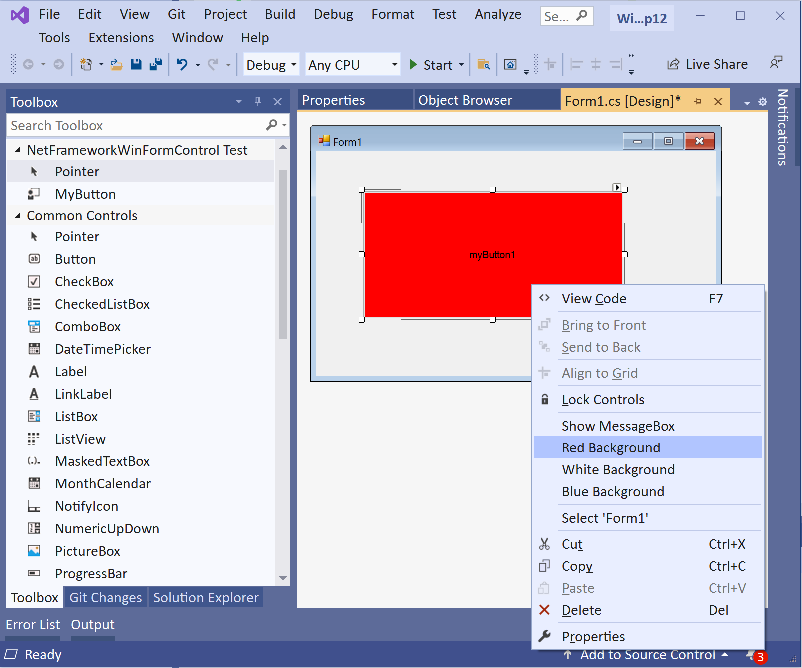

# VS2022-Net6-WindowsFormsControls-DesignerExtensibility
Figuring out designer extensibility support for custom Net6 WinForms controls in VS2022

### Folder VS2019_DN4pt6WinFormControl contains a .Net Framework 4.6 example of a Windows Forms custom MyButton control with designer extensiblity in Visual Studio 2019. 
This is included here as an example of what I want to do with a Net6 Windows Forms custom control in Visual Studio 2022 (Automatically add control to Visual Studio toolbox and support design-time behavior).

Steps to see VS2019_DN4pt6WinFormControl example:
1. Open VS2019_DN4pt6WinFormControl.sln in Visual Studio 2019
2. Build release configuration
3. From solution folder run copyBinToTempFlder.bat to copy .\NetFrameworkWinFormControl\bin\release to c:\temp\NetFrameworkWinFormControl\bin (or copy by hand)
4. Run RegistryEntriesForVS2019IDE.reg to add registry entries to automatically load MyButton control into the VS2019 Toolbox for Windows Forms projects, and to inform VS2019 that NetFrameworkWinFormControl.Design.dll is in the Design subfolder.
5. In VS2019 make a new .Net Framework Windows Forms project. 
6. Open the Form1 design surface.
7. Open the VS2019 Toolbox. Observe that the MyButton control is in the VS toolbox (thanks to the toolbox registry entry in step 4).
8. Click MyButton in the toolbox and then click Form1 design design surface to draw MyButton control
9. Rt-click MyButton control on Form1 design surface to use functional design-time context menu items (image below)

